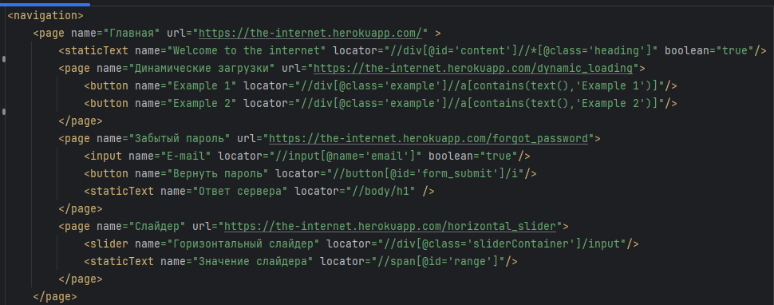
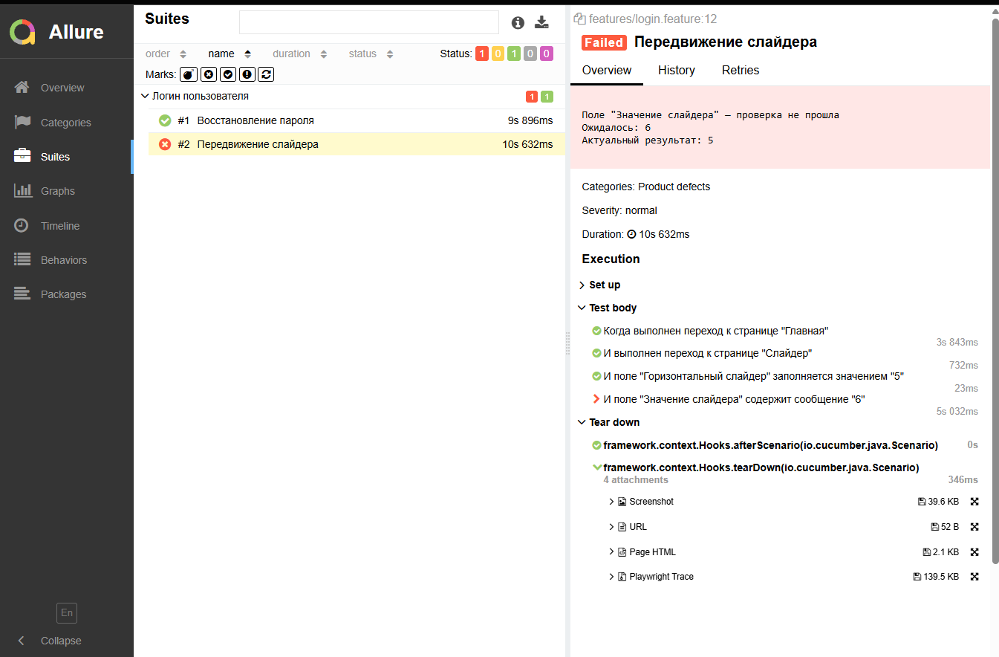

# QA Automation Framework (Java + Playwright + Cucumber)

## О проекте

Проект представляет собой **UI QA Automation Framework**, предназначенный для автоматизации тестирования веб-приложений.

Фреймворк построен с упором на:
- масштабируемость
- читаемость тестов
- низкий порог вхождения для стажеров и джунов
- минимизацию дублирующегося кода
---

## Архитектурный подход

### Отказ от классического Page Object Pattern

Вместо классического Page Object Pattern, при котором каждая страница и каждый блок описываются отдельными Java-классами, в проекте используется **XML-репозиторий элементов**.

Это позволяет:
- избежать разрастания количества Page Object классов
- хранить описание UI декларативно
- централизованно управлять локаторами и типами элементов

### XML Repository

- UI-элементы описываются в XML
- каждая запись содержит тип элемента и способ взаимодействия
- Java-код работает с абстракциями, а не с конкретными страницами
  
Добавление нового элемента или страницы **не требует создания нового Java-класса**.

## Тесты и отчёты

Используется **Cucumber** для описания сценариев и **Allure** для отчётности.

Allure-отчёты содержат:
- шаги сценариев
- причину падения
- вложения (скриншоты, HTML страницы, Playwright trace)
- сообщения об ошибках читаемы и кратки

### Пример отчёта Allure

- централизованное логирование
- подавлен лишний шум от Playwright
- сообщения об ошибках читаемы как для тех.специалиста, так и для менеджмента

---

## Примечание

В репозитории представлен пример использования фреймворка.  
Внутренние компоненты и ядро могут быть предоставлены на коммерческой основе.
